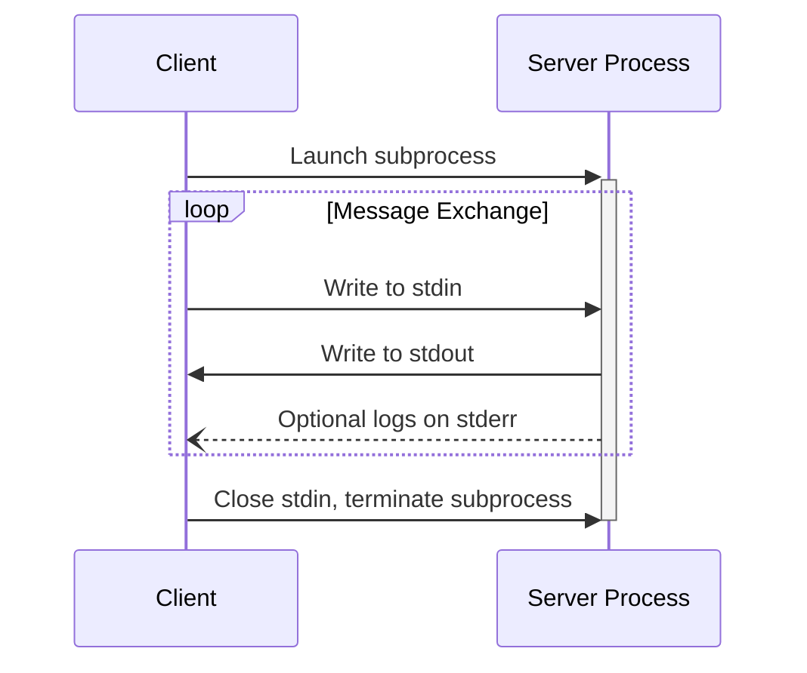
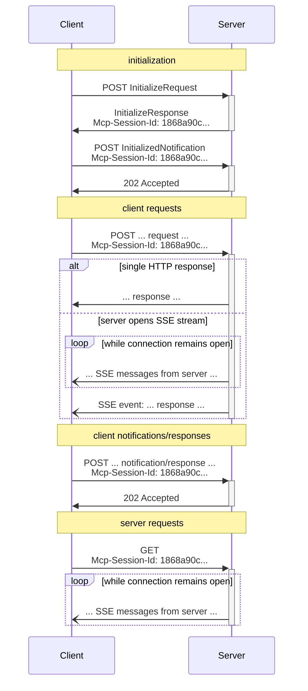

<div id="enable-section-numbers" />

<Info>**Protocol Revision**: draft</Info>

MCP uses JSON-RPC to encode messages. JSON-RPC messages **MUST** be UTF-8 encoded.

The protocol currently defines three standard transport mechanisms for client-server
communication:

1. [stdio](#stdio), communication over standard in and standard out
2. [Streamable HTTP](#streamable-http)
3. [WebSocket](#websocket)

Clients **SHOULD** support stdio whenever possible.

It is also possible for clients and servers to implement
[custom transports](#custom-transports) in a pluggable fashion.

## stdio

In the **stdio** transport:

- The client launches the MCP server as a subprocess.
- The server reads JSON-RPC messages from its standard input (`stdin`) and sends messages
  to its standard output (`stdout`).
- Messages are individual JSON-RPC requests, notifications, or responses.
- Messages are delimited by newlines, and **MUST NOT** contain embedded newlines.
- The server **MAY** write UTF-8 strings to its standard error (`stderr`) for logging
  purposes. Clients **MAY** capture, forward, or ignore this logging.
- The server **MUST NOT** write anything to its `stdout` that is not a valid MCP message.
- The client **MUST NOT** write anything to the server's `stdin` that is not a valid MCP
  message.



## Streamable HTTP

<Info>

This replaces the [HTTP+SSE
transport](/specification/2024-11-05/basic/transports#http-with-sse) from
protocol version 2024-11-05. See the [backwards compatibility](#backwards-compatibility)
guide below.

</Info>

In the **Streamable HTTP** transport, the server operates as an independent process that
can handle multiple client connections. This transport uses HTTP POST and GET requests.
Server can optionally make use of
[Server-Sent Events](https://en.wikipedia.org/wiki/Server-sent_events) (SSE) to stream
multiple server messages. This permits basic MCP servers, as well as more feature-rich
servers supporting streaming and server-to-client notifications and requests.

The server **MUST** provide a single HTTP endpoint path (hereafter referred to as the
**MCP endpoint**) that supports both POST and GET methods. For example, this could be a
URL like `https://example.com/mcp`.

#### Security Warning

When implementing Streamable HTTP transport:

1. Servers **MUST** validate the `Origin` header on all incoming connections to prevent DNS rebinding attacks
2. When running locally, servers **SHOULD** bind only to localhost (127.0.0.1) rather than all network interfaces (0.0.0.0)
3. Servers **SHOULD** implement proper authentication for all connections

Without these protections, attackers could use DNS rebinding to interact with local MCP servers from remote websites.

### Sending Messages to the Server

Every JSON-RPC message sent from the client **MUST** be a new HTTP POST request to the
MCP endpoint.

1. The client **MUST** use HTTP POST to send JSON-RPC messages to the MCP endpoint.
2. The client **MUST** include an `Accept` header, listing both `application/json` and
   `text/event-stream` as supported content types.
3. The body of the POST request **MUST** be a single JSON-RPC _request_, _notification_, or _response_.
4. If the input is a JSON-RPC _response_ or _notification_:
   - If the server accepts the input, the server **MUST** return HTTP status code 202
     Accepted with no body.
   - If the server cannot accept the input, it **MUST** return an HTTP error status code
     (e.g., 400 Bad Request). The HTTP response body **MAY** comprise a JSON-RPC _error
     response_ that has no `id`.
5. If the input is a JSON-RPC _request_, the server **MUST** either
   return `Content-Type: text/event-stream`, to initiate an SSE stream, or
   `Content-Type: application/json`, to return one JSON object. The client **MUST**
   support both these cases.
6. If the server initiates an SSE stream:
   - The SSE stream **SHOULD** eventually include JSON-RPC _response_ for the
     JSON-RPC _request_ sent in the POST body.
   - The server **MAY** send JSON-RPC _requests_ and _notifications_ before sending the
     JSON-RPC _response_. These messages **SHOULD** relate to the originating client
     _request_.
   - The server **SHOULD NOT** close the SSE stream before sending the JSON-RPC _response_
     for the received JSON-RPC _request_, unless the [session](#session-management)
     expires.
   - After the JSON-RPC _response_ has been sent, the server **SHOULD** close the SSE
     stream.
   - Disconnection **MAY** occur at any time (e.g., due to network conditions).
     Therefore:
     - Disconnection **SHOULD NOT** be interpreted as the client cancelling its request.
     - To cancel, the client **SHOULD** explicitly send an MCP `CancelledNotification`.
     - To avoid message loss due to disconnection, the server **MAY** make the stream
       [resumable](#resumability-and-redelivery).

### Listening for Messages from the Server

1. The client **MAY** issue an HTTP GET to the MCP endpoint. This can be used to open an
   SSE stream, allowing the server to communicate to the client, without the client first
   sending data via HTTP POST.
2. The client **MUST** include an `Accept` header, listing `text/event-stream` as a
   supported content type.
3. The server **MUST** either return `Content-Type: text/event-stream` in response to
   this HTTP GET, or else return HTTP 405 Method Not Allowed, indicating that the server
   does not offer an SSE stream at this endpoint.
4. If the server initiates an SSE stream:
   - The server **MAY** send JSON-RPC _requests_ and _notifications_ on the stream.
   - These messages **SHOULD** be unrelated to any concurrently-running JSON-RPC
     _request_ from the client.
   - The server **MUST NOT** send a JSON-RPC _response_ on the stream **unless**
     [resuming](#resumability-and-redelivery) a stream associated with a previous client
     request.
   - The server **MAY** close the SSE stream at any time.
   - The client **MAY** close the SSE stream at any time.

### Multiple Connections

1. The client **MAY** remain connected to multiple SSE streams simultaneously.
2. The server **MUST** send each of its JSON-RPC messages on only one of the connected
   streams; that is, it **MUST NOT** broadcast the same message across multiple streams.
   - The risk of message loss **MAY** be mitigated by making the stream
     [resumable](#resumability-and-redelivery).

### Resumability and Redelivery

To support resuming broken connections, and redelivering messages that might otherwise be
lost:

1. Servers **MAY** attach an `id` field to their SSE events, as described in the
   [SSE standard](https://html.spec.whatwg.org/multipage/server-sent-events.html#event-stream-interpretation).
   - If present, the ID **MUST** be globally unique across all streams within that
     [session](#session-management)—or all streams with that specific client, if session
     management is not in use.
2. If the client wishes to resume after a broken connection, it **SHOULD** issue an HTTP
   GET to the MCP endpoint, and include the
   [`Last-Event-ID`](https://html.spec.whatwg.org/multipage/server-sent-events.html#the-last-event-id-header)
   header to indicate the last event ID it received.
   - The server **MAY** use this header to replay messages that would have been sent
     after the last event ID, _on the stream that was disconnected_, and to resume the
     stream from that point.
   - The server **MUST NOT** replay messages that would have been delivered on a
     different stream.

In other words, these event IDs should be assigned by servers on a _per-stream_ basis, to
act as a cursor within that particular stream.

### Session Management

An MCP "session" consists of logically related interactions between a client and a
server, beginning with the [initialization phase](/specification/draft/basic/lifecycle). To support
servers which want to establish stateful sessions:

1. A server using the Streamable HTTP transport **MAY** assign a session ID at
   initialization time, by including it in an `Mcp-Session-Id` header on the HTTP
   response containing the `InitializeResult`.
   - The session ID **SHOULD** be globally unique and cryptographically secure (e.g., a
     securely generated UUID, a JWT, or a cryptographic hash).
   - The session ID **MUST** only contain visible ASCII characters (ranging from 0x21 to
     0x7E).
2. If an `Mcp-Session-Id` is returned by the server during initialization, clients using
   the Streamable HTTP transport **MUST** include it in the `Mcp-Session-Id` header on
   all of their subsequent HTTP requests.
   - Servers that require a session ID **SHOULD** respond to requests without an
     `Mcp-Session-Id` header (other than initialization) with HTTP 400 Bad Request.
3. The server **MAY** terminate the session at any time, after which it **MUST** respond
   to requests containing that session ID with HTTP 404 Not Found.
4. When a client receives HTTP 404 in response to a request containing an
   `Mcp-Session-Id`, it **MUST** start a new session by sending a new `InitializeRequest`
   without a session ID attached.
5. Clients that no longer need a particular session (e.g., because the user is leaving
   the client application) **SHOULD** send an HTTP DELETE to the MCP endpoint with the
   `Mcp-Session-Id` header, to explicitly terminate the session.
   - The server **MAY** respond to this request with HTTP 405 Method Not Allowed,
     indicating that the server does not allow clients to terminate sessions.

### Sequence Diagram



### Protocol Version Header

If using HTTP, the client **MUST** include the `MCP-Protocol-Version:
<protocol-version>` HTTP header on all subsequent requests to the MCP
server, allowing the MCP server to respond based on the MCP protocol version.

For example: `MCP-Protocol-Version: 2025-06-18`

The protocol version sent by the client **SHOULD** be the one [negotiated during
initialization](/specification/draft/basic/lifecycle#version-negotiation).

For backwards compatibility, if the server does _not_ receive an `MCP-Protocol-Version`
header, and has no other way to identify the version - for example, by relying on the
protocol version negotiated during initialization - the server **SHOULD** assume protocol
version `2025-03-26`.

If the server receives a request with an invalid or unsupported
`MCP-Protocol-Version`, it **MUST** respond with `400 Bad Request`.

### Backwards Compatibility

Clients and servers can maintain backwards compatibility with the deprecated [HTTP+SSE
transport](/specification/2024-11-05/basic/transports#http-with-sse) (from
protocol version 2024-11-05) as follows:

**Servers** wanting to support older clients should:

- Continue to host both the SSE and POST endpoints of the old transport, alongside the
  new "MCP endpoint" defined for the Streamable HTTP transport.
  - It is also possible to combine the old POST endpoint and the new MCP endpoint, but
    this may introduce unneeded complexity.

**Clients** wanting to support older servers should:

1. Accept an MCP server URL from the user, which may point to either a server using the
   old transport or the new transport.
2. Attempt to POST an `InitializeRequest` to the server URL, with an `Accept` header as
   defined above:
   - If it succeeds, the client can assume this is a server supporting the new Streamable
     HTTP transport.
   - If it fails with an HTTP 4xx status code (e.g., 405 Method Not Allowed or 404 Not
     Found):
     - Issue a GET request to the server URL, expecting that this will open an SSE stream
       and return an `endpoint` event as the first event.
     - When the `endpoint` event arrives, the client can assume this is a server running
       the old HTTP+SSE transport, and should use that transport for all subsequent
       communication.

## WebSocket

This transport enables full bidirectional communication over a WebSocket connection.

The server **MUST** provide an HTTP endpoint path that supports WebSocket upgrade HTTP request. This **MAY** be the same endpoint as the Streamable HTTP transport, or a different one.

### Message Handling

All messages **MUST** be sent as UTF-8 encoded text frames. Binary frames are not supported and **MUST** result in connection termination with close code `1003` (Unsupported Data).

### MCP Session For WebSocket Transport

[NOTE: This transport now depends upon SEP-1364 which elevates MCP sessions in the data layer utilizing a `sessionId` field in the JSON-RPC package]

In Streamable HTTP transport, session IDs are primarily used for update subscription management when using the streaming/SSE channel. It is optional for stateless HTTP use since the "session" only lasts for duration of a single request/response cycle. However, the motivation for this WebSocket transport is to enable bi-directional usage. So, servers and clients using this WebSocket transport **MUST** provide session support and must include the `sessionId` field in all messages except the first `initialize` request as specified in SEP-1364 alternative 2 [TODO: adjust wording and link to the correct place when SEP-1364 is finalized].

#### MCP `sessionId` Requirements

- Session IDs **SHOULD** be globally unique and cryptographically secure (e.g., a securely generated UUID, a JWT, or a cryptographic hash)
- Session IDs **MUST** contain only visible ASCII characters (0x21 to 0x7E)
- Servers **MUST** maintain exactly one active WebSocket connection per MCP `sessionId`. The most recently established connection becomes the active connection for that MCP session.
- Upon reconnection, the client calls initialize with a `sessionId` and the server **MUST** close any still open WebSocket connection associated with that session ID with close code `1000` (Normal Closure) and reason "MCP session reconnected on another connection"
- Close frames might be ignored and there is delay in effectualization, so the server **MUST** also ignore any messages that arrive for the MCP session on any connection but the active one
- Server-initiated notifications **MUST** be sent over the active connection
- Clients **SHOULD** keep track of unacknowledged messages and resend them if necessary after reconnection

### WebSocket Transport Lifecycle

#### Initial Connection and Session Establishment

**Client Behavior:**
- Establish WebSocket connection to server
- Send MCP `initialize` without `sessionId`
- Wait for `initialize` response and extract `sessionId`
- Store `sessionId` for reconnection
- Send `notifications/initialized` with `sessionId` [TODO: SEP-1364 envisions making this optional. Adjust once finalized]

**Server Behavior:**
- Accept WebSocket connection
- Generate and include `sessionId` when responding to `initialize` request

#### Normal Operation

During normal operation:
- Client **MUST** include the `sessionId` in all messages except the first `initialize`
- Server **MUST** close the WebSocket connection with close code `1008` (Policy Violation) and reason "Missing sessionId" for requests without `sessionId` (other than `initialize`)
- Server maintains session state and processes requests normally
- Server may send notifications to the client at any time
- Both client and server should handle JSON-RPC requests and responses according to MCP specification

#### Disconnection Handling

WebSocket connection interruption might occur at any time (e.g., due to network conditions). Therefore:
- WebSocket connection interruption **MUST NOT** be interpreted as the client cancelling its request
- To cancel, the client **SHOULD** explicitly send an MCP `CancelledNotification`
- Similarly, disconnection **MUST NOT** be interpreted as terminating the MCP session
- Server **MUST** preserve session state for a reasonable timeout period to allow reconnection

#### Reconnection and Session Recovery

Upon reconnection:
- Client **MUST** include the `sessionId` from the previous session in an `initialize` call after reconnection
- Server **MUST** recognize the existing `sessionId` and associate this new connection with previously established session state
- Server **MUST** close any previous WebSocket connection associated with the same MCP `sessionId` with close code `1000` (Normal Closure) and reason "MCP session reconnected on another connection"
- Normal operation can resume immediately after MCP session recognition

#### Session Termination

- The server **MAY** terminate the session at any time by sending `notifications/terminate`, after which it **MUST** close the WebSocket connection with appropriate close code and reason message [TODO: I don't see this in SEP-1364, but it should be added]
- Servers **MAY** implement session timeout policies for cleaning up MCP session resources
- Clients **MAY** terminate session at any time by sending a `terminate` method call
- Upon receipt of the `terminate` method, server **MUST** send a `TerminateResult` and then immediately close the associated WebSocket connection with close code `1000` (Normal Closure) and reason "MCP session terminated" [TODO: `terminate` method is added in SEP-1364 alternative 2. Adjust wording and link to the correct place when SEP-1364 is finalized]
- Upon session termination, server **SHOULD** cleanup session state

### Error Handling

#### HTTP to WS Upgrade Errors

Servers **MUST** return appropriate HTTP status codes during WebSocket upgrade failures:

- `404 Not Found`: WebSocket endpoint or message handler not found

#### WebSocket Protocol Errors

Note: The only way to communicate errors at this level is to terminate with a close code and an optional reason. These errors **MUST NOT** result in the termination of the MCP Session. After such an error, the client is free to reconnect using an active MCP `sessionId` to resume normal operation.

- Invalid UTF-8 encoding **MUST** result in connection termination with close code `1007` (Invalid frame payload data)
- Malformed JSON messages **MUST** result in connection termination with close code `1003` (Unsupported Data)
- Invalid envelope format **MUST** result in connection termination with close code `1003` (Unsupported Data)
- When a server receives a message with an unknown or inactive session ID but an otherwise valid envelope, it **MUST** close the WebSocket connection with close code `1008` (Policy Violation) and reason "Unknown session ID"

### Security

**Warning: MCP `sessionId` is not a security mechanism**. It does not provide authentication or authorization. This specification defines MCP session management for connection persistence and reconnection, which is orthogonal to user authentication and authorization.

When implementing WebSocket transport:
1. Servers **MUST** validate the `Origin` header on all incoming WebSocket upgrade requests to prevent Cross-Site WebSocket Hijacking and DNS rebinding attacks
2. When running locally, servers **SHOULD** bind only to localhost (127.0.0.1) rather than all network interfaces (0.0.0.0)
3. Servers **SHOULD** implement proper authentication for all connections

Refer to [Authorization](/specification/draft/basic/authorization) for guidance on how to implement authorization for HTTP and WebSocket transports. WebSocket transport smuggles in the auth token in the list of subprotocols provided by the client rather than via headers due to the inaccessibility of headers in the browser WebSocket API.

### Example Messages

**Original Client Initialize Request:**
```json
{
  "jsonrpc": "2.0",
  "id": "1",
  "method": "initialize",
  // `sessionId` is not included in the first request
  "params": {
    "protocolVersion": "DRAFT-2025-v3",
    "capabilities": {...},
    "clientInfo": {...}
  }
}
```

**Server Initialize Response:**
```json
{
  "jsonrpc": "2.0",
  "id": "1",
  "sessionId": "550e8400-e29b-41d4-a716-446655440000",
  "result": {
    "protocolVersion": "DRAFT-2025-v3",
    "capabilities": {...},
    "serverInfo": {...}
  }
}
```

**Subsequent Client Message [TODO: This is optional in SEP-1364 if protocolVersions match. Adjust accordingly once SEP-1364 is finalized]:**
```json
{
  "jsonrpc": "2.0",
  "method": "notifications/initialized",
  "sessionId": "550e8400-e29b-41d4-a716-446655440000"
}
```

**Reconnect Client Initialize Request:**
```json
{
  "jsonrpc": "2.0",
  "id": "1",
  "method": "initialize",
  "sessionId": "550e8400-e29b-41d4-a716-446655440000",
  "params": {
    "protocolVersion": "DRAFT-2025-v3",
    "capabilities": {...},
    "clientInfo": {...}
  }
}
```

## Custom Transports

Clients and servers **MAY** implement additional custom transport mechanisms to suit
their specific needs. The protocol is transport-agnostic and can be implemented over any
communication channel that supports bidirectional message exchange.

Implementers who choose to support custom transports **MUST** ensure they preserve the
JSON-RPC message format and lifecycle requirements defined by MCP. Custom transports
**SHOULD** document their specific connection establishment and message exchange patterns
to aid interoperability.
